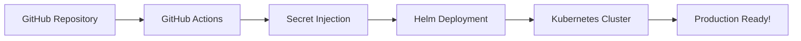

# 🚀 Kubernetes Infrastructure Automation Platform

[](LICENSE)
[](https://kubernetes.io/)
[](https://helm.sh/)
[](https://www.gitops.tech/)

> **Transform any Kubernetes cluster into a production-ready platform in minutes, not days.**

This repository provides a **100% open-source**, **GitOps-driven** solution to automatically provision a complete Kubernetes infrastructure stack with enterprise-grade components. Simply configure a few GitHub secrets, and your cluster will be equipped with monitoring, security, storage, databases, and more.

## 🎯 **Vision & Mission**

**Mission**: Democratize enterprise-grade Kubernetes infrastructure by making it accessible, automated, and affordable for teams of all sizes.

**Vision**: Every development team should have access to production-ready Kubernetes infrastructure without the complexity and overhead traditionally required.

## ✨ **What This Solves**

### **The Problem**
- **Weeks of manual setup** for production-ready Kubernetes clusters
- **Complex configurations** scattered across multiple documentation sources  
- **Inconsistent environments** between development, testing, and production
- **Security misconfigurations** and missed best practices
- **High barrier to entry** for teams wanting to leverage Kubernetes effectively

### **The Solution**
- **🔄 One-click deployment** via GitHub Actions
- **📋 Standardized configurations** following industry best practices
- **🔒 Security-first approach** with automated SSL/TLS and secrets management
- **📊 Complete observability** out of the box
- **💾 Production-grade storage** and database solutions
- **🌍 Multi-environment support** (test/staging/production)

## 🏗️ **Infrastructure Components**

### **🔧 Core Infrastructure**
| Component | Purpose | Technology |
|-----------|---------|------------|
| **SSL/TLS Management** | Automatic certificate provisioning & renewal | Cert-Manager + Let's Encrypt |
| **Persistent Storage** | High-performance, replicated block storage | Longhorn Storage |
| **Ingress Controller** | Load balancing & traffic routing | Traefik |
| **DNS Challenge** | Automated certificate validation | CloudFlare DNS |

### **🔐 Security & Secrets**
| Component | Purpose | Technology |
|-----------|---------|------------|
| **Secrets Management** | Centralized secrets storage & injection | HashiCorp Vault |
| **Certificate Authority** | Automated SSL/TLS certificates | Let's Encrypt (ACME) |
| **Secret Injection** | Runtime secret injection for applications | Vault Agent Injector |

### **📊 Monitoring & Observability**
| Component | Purpose | Technology |
|-----------|---------|------------|
| **Metrics Collection** | Cluster & application metrics | Prometheus |
| **Visualization** | Dashboards & analytics | Grafana |
| **Log Aggregation** | Centralized logging solution | Loki + Promtail |
| **Alerting** | Intelligent alerting & notifications | Grafana Alerting + Slack |
| **Service Discovery** | Automatic service monitoring | Prometheus Operator |

### **💾 Database Solutions**
| Component | Purpose | Technology |
|-----------|---------|------------|
| **PostgreSQL** | Cloud-native PostgreSQL clusters | CloudNativePG Operator |
| **High Availability** | Automated backup & recovery | CloudNativePG |
| **Monitoring Integration** | Database metrics & alerting | Prometheus ServiceMonitors |

## 🚦 **Deployment Architecture**

### **🔄 GitOps Workflow**


### **🏢 Multi-Environment Support**
- **🧪 Test Environment**: Pull request validation on local k3s
- **🚀 Production Environment**: Automated deployment on push to main
- **📈 Staging Environment**: On-demand deployment via workflow dispatch

### **📦 Deployment Stages**
1. **Core Infrastructure**: SSL, Storage, Ingress
2. **Security Layer**: Vault, Secrets Management  
3. **Monitoring Stack**: Prometheus, Grafana, Loki
4. **Database Layer**: PostgreSQL clusters
5. **Application Layer**: Ready for your applications!

## 🛠️ **Quick Start**

### **Prerequisites**
- Kubernetes cluster (k3s, EKS, GKE, AKS, etc.)
- GitHub repository with Actions enabled
- Domain name with CloudFlare DNS management

### **1. Fork & Configure**
```bash
# Fork this repository
git clone https://github.com/Esteem-Tech/k8s-up.git
cd k8s-up
```

### **2. Set GitHub Secrets**
Configure these secrets in your GitHub repository settings:

| Secret | Description | Example |
|--------|-------------|---------|
| `CLUSTER_KUBECONFIG` | Base64-encoded kubeconfig file | `kubectl config view --raw \| base64` |
| `GRAFANA_ADMIN_PASSWORD` | Grafana admin password | `your-secure-password` |
| `CLOUDFLARE_API_TOKEN` | CloudFlare API token for DNS | `your-cloudflare-token` |
| `ISSUER_NOTIFICATION_EMAIL` | Email for Let's Encrypt notifications | `admin@yourdomain.com` |
| `SLACK_WEBHOOK_URL` | Slack webhook for alerts | `https://hooks.slack.com/...` |

### **3. Customize Configuration**
Update the domain configuration in values files:
```yaml
# In grafana-values.yml, loki-values.yml, etc.
hosts:
  - "monitoring.yourdomain.com"  # Replace with your domain
```

### **4. Deploy**
```bash
# Push to main branch for production deployment
git add .
git commit -m "Configure infrastructure for my cluster"
git push origin main

# Or create a PR for test environment validation
```

### **5. Access Your Infrastructure**
- **Grafana**: `https://monitoring.yourdomain.com`
- **Vault**: `https://vault.yourdomain.com` 
- **Longhorn**: `https://longhorn.yourdomain.com`

## 📊 **What You Get Out of the Box**

### **🎯 Monitoring & Alerting**
- **Complete cluster visibility** with 20+ pre-configured dashboards
- **Application performance monitoring** with custom metrics support
- **Intelligent alerting** with Slack integration
- **Log aggregation** from all cluster components
- **Resource utilization tracking** and capacity planning

### **🔒 Enterprise Security**
- **Automatic SSL/TLS** for all services
- **Centralized secrets management** with Vault
- **RBAC configurations** following security best practices
- **Network policies** for micro-segmentation
- **Certificate rotation** and renewal automation

### **💾 Production-Grade Storage**
- **Replicated block storage** with automatic failover
- **Snapshot capabilities** for backup and recovery
- **Dynamic provisioning** for stateful applications
- **Performance monitoring** and optimization

### **🗄️ Database Solutions**
- **Highly available PostgreSQL** clusters
- **Automated backup and recovery**
- **Connection pooling** and performance optimization
- **Monitoring integration** with custom dashboards

## 🌟 **Benefits for Development Teams**

### **⚡ Speed & Efficiency**
- **90% faster** cluster setup compared to manual configuration
- **Zero-downtime deployments** with rolling updates
- **Consistent environments** across all stages
- **Self-service infrastructure** for development teams

### **💰 Cost Optimization**
- **Resource optimization** through monitoring and alerting
- **Efficient storage utilization** with Longhorn
- **Reduced operational overhead** through automation
- **Pay-as-you-grow** scalability model

### **🔧 Developer Experience**
- **GitOps workflow** with familiar Git-based processes
- **Self-documenting infrastructure** through code
- **Easy customization** through Helm values
- **Comprehensive logging** for troubleshooting

### **🛡️ Risk Reduction**
- **Industry-standard security** configurations
- **Automated compliance** with security best practices  
- **Disaster recovery** capabilities built-in
- **Proven, battle-tested** components

## 🔧 **Customization & Extension**

### **Adding Applications**
```yaml
# Create application-specific values
apiVersion: apps/v1
kind: Deployment
metadata:
  name: my-app
  annotations:
    prometheus.io/scrape: "true"  # Automatic monitoring
spec:
  # Your application configuration
```

### **Custom Dashboards**
```bash
# Add Grafana dashboards
kubectl create configmap my-dashboard \
  --from-file=dashboard.json \
  -n monitoring
```

### **Additional Databases**
```yaml
# Deploy additional PostgreSQL clusters
apiVersion: postgresql.cnpg.io/v1
kind: Cluster
metadata:
  name: my-database
spec:
  instances: 3
  storage:
    size: 50Gi
    storageClass: longhorn
```

## 📈 **Scaling & Production Readiness**

### **Horizontal Scaling**
- **Multi-node support** with automatic load balancing
- **Resource-based autoscaling** for applications
- **Storage expansion** without downtime
- **Database read replicas** for high-traffic applications

### **High Availability**
- **Multi-zone deployments** for fault tolerance
- **Automated failover** for all components
- **Backup strategies** for data protection
- **Disaster recovery** procedures documented

### **Performance Optimization**
- **Resource limit recommendations** based on monitoring data
- **Storage performance tuning** for your workloads
- **Network optimization** for multi-service communication
- **Database query optimization** through monitoring

## 🤝 **Contributing**

We welcome contributions from the community! Here's how you can help:

### **🐛 Bug Reports**
- Use GitHub Issues to report bugs
- Include cluster information and logs
- Provide minimal reproduction steps

### **✨ Feature Requests**
- Suggest new components or improvements
- Share your use cases and requirements
- Participate in design discussions

### **💻 Code Contributions**
1. Fork the repository
2. Create a feature branch
3. Test your changes thoroughly
4. Submit a pull request with detailed description

### **📚 Documentation**
- Improve existing documentation
- Add tutorials and examples
- Share your deployment experiences

## 📞 **Community & Support**

### **💬 Get Help**
- **GitHub Discussions**: Ask questions and share experiences
- **Issues**: Report bugs and request features
- **Wiki**: Community-maintained documentation and tutorials

### **🎓 Learning Resources**
- **Architecture Deep Dives**: Understand the design decisions
- **Best Practices**: Learn from production deployments
- **Troubleshooting Guides**: Common issues and solutions

## 🎖️ **Recognition**

This project is built on the shoulders of giants. Special thanks to:
- **CNCF Projects**: Kubernetes, Prometheus, Grafana, Loki
- **HashiCorp**: Vault for secrets management
- **Cert-Manager**: Automated certificate management
- **Longhorn**: Cloud-native storage solution
- **CloudNativePG**: PostgreSQL operator for Kubernetes

## 📜 **License**

This project is licensed under the MIT License - see the [LICENSE](LICENSE) file for details.

---

**🌟 Star this repository** if it helps your team build better Kubernetes infrastructure!

**🐛 Found an issue?** Please report it in our [GitHub Issues](https://github.com/yourusername/k8s-monitoring/issues).

**💡 Have an idea?** We'd love to hear about it in [GitHub Discussions](https://github.com/yourusername/k8s-monitoring/discussions).

---

*Built with ❤️ by the open-source community for the open-source community.*
